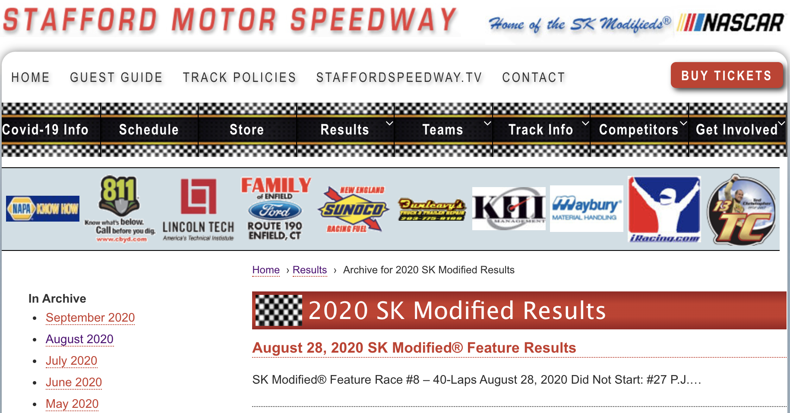

# Stafford Motor Speedway Racing Results Twitter Bot
his script allows the user to recieve up to date notifications directly from twitter to share the most recent racing results from Stafford Motor Spedway's SK Modified Feature Events.

##### [Stafford Motor Speedway](https://staffordmotorspeedway.com/)
- 
##### [@TheKingTC13](https://twitter.com/TheKingTC13)

<!--  -->

---

### Variables for functions to change
- archiveURL = "ARTICLEURL" - The URL that contains a list of posts.
- webhook_url = "WEBHOOKURL" - The webhook URL if you want to send messages using webhooks.
- twitterUser = 'TWITTERUSERNAME' - The twitter username of the account that is tweeting, used for creating twreads of tweets.

### [TWEEPY](https://www.tweepy.org/) Twitter API Variables to change
To create and use the twitter API apply for a [Twitter Developer Account](https://developer.twitter.com/).
- ckey = "APIKEY" - Consumer Key
- csecret = "APISECRETKEY" - Consumer Secret
- atoken = "APIACCESSTOKEN" - Access Token
- asecret = "APIACCESSTOKENSECRET" - Access Token Secret

### Functions in Script
- tweepyThread - Function using [tweepy](https://www.tweepy.org/) in order to send multiple tweets in a thread fashion.
- discordMessage - Function using [requests](https://requests.readthedocs.io/en/master/) to send messages over webhooks, this one is used mainly for discord.
- staffordResults - The main part of this script

Retrieves Race results posted on Stafford (staffordmotorspeedway.com) website and tweets them out on Twitter (@TheKingTC13)
